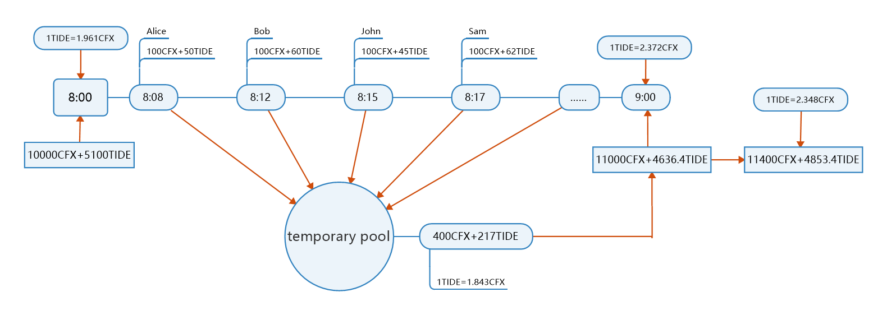
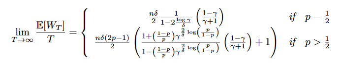
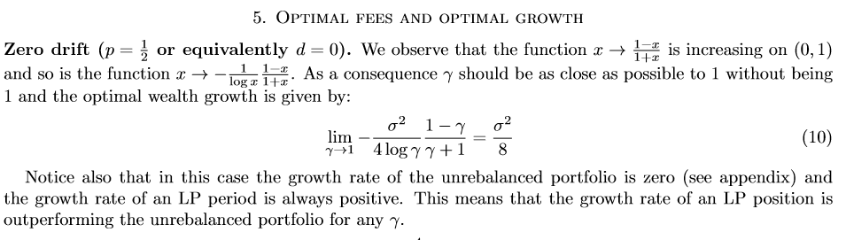
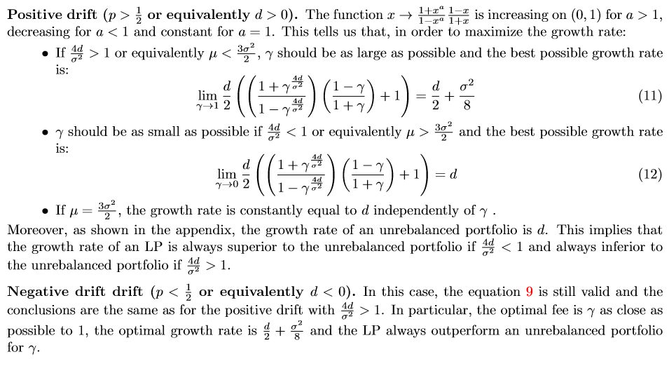

# Tideswap: Actively adjust market price DEX 

### Introduction

Tideswap is a DEX based on Uniswap, which can delay the capital injection of liquidity and active price discovery, so as to bring higher yield for traders and liquidity providers.

The new funds of the liquidity provider will be kept by the contract temporarily, and will be injected into the flow pool uniformly each integral point.

Because different users participate in the market making within an hour, the proportion of the two kinds of tokens is different, and the two assets proportion will fluctuate.

### Math
Growth Rate of LP Wealth  

  

  

  
### Tips: If the images fail to load successfully, try using VPN to access.
